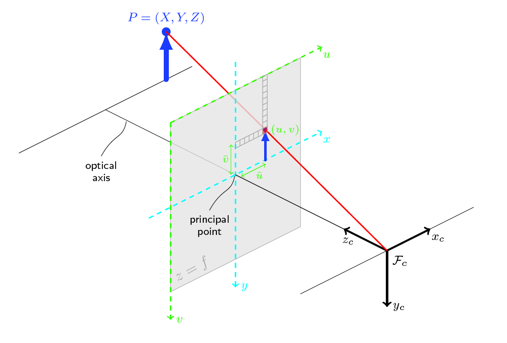
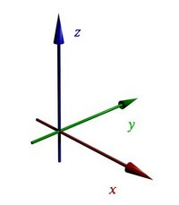

For original documentation please refer to https://github.com/tzutalin/labelImg.  

install python-pcl - Latest commit 1d83d2d plus the solution on the following issue
https://github.com/strawlab/python-pcl/issues/127

All changes in the labelImg.py file are marked by "# Blender change".  
File changed include:
* labelImg.py
* libs/labelFile.py
* data/pretrained_classes.txt
File added include:
* create_blender_bbox.py
* pascal_to_yolo.py

### What the tool does
* Map pixel box coordinates to camera box coordinates
* Map camera box coordinates to world box coordinates
* Based on world coordinates and the overall transformation matrix, calculate the midpoint, dimension and orientation of each bounding box
* Display boxes in Blender with a separate script

### Directory structure under the top level project directory is as follows:
* visim_project.json
* **output**
    * **1_InertialPose**
        * imu_data.csv
        * pose_data.csv
    * **2_Blender**
        * **cam0_rgbd** 
            * .exr images
    * **3_labelimg**
        * .xml Pascal format labels
        * world_bbox.txt
        
### How to use the label tool:
* python3 labelImg.py
* Click "Open Dir" button and select the top level project folder
* Click "Create RectBox" button to create labels
* Click "Save" to save labels
* Click "Export to Blender" to calculate and save 3D bounding box info for Blender use
   * box info is stored in the format "xm ym zm xd zd yd ex ez ey" where "m" stands for midpoint, "d" stands for dimension, and "e" stands for Euler angle
   * The path to the saved "world_bbox.txt" would be displayed in a pop-up window; it should be /path/to/project/output/3_labelimg/world_bbox.txt.
   
### How to create 3D bounding boxes in Blender
* Open blender and the 3D model (a .blend file)
* Open Text Editor
* Open the script "create_blender_bbox.py" from this repo, drag the border to view file content, and change the "/path/to/project" to the actual path
* Click "Run Script"
Note: Another way would be to run "./blender -b --python /path/to/create_blender_box.py" directly from command line. However, sometimes this doesn't work...

### Notes
* For changes in resources.qrc, run "rcc -binary resources.qrc -o resources.rcc"
* Coordinate systems of the pixel image, camera and world are as shown below:

